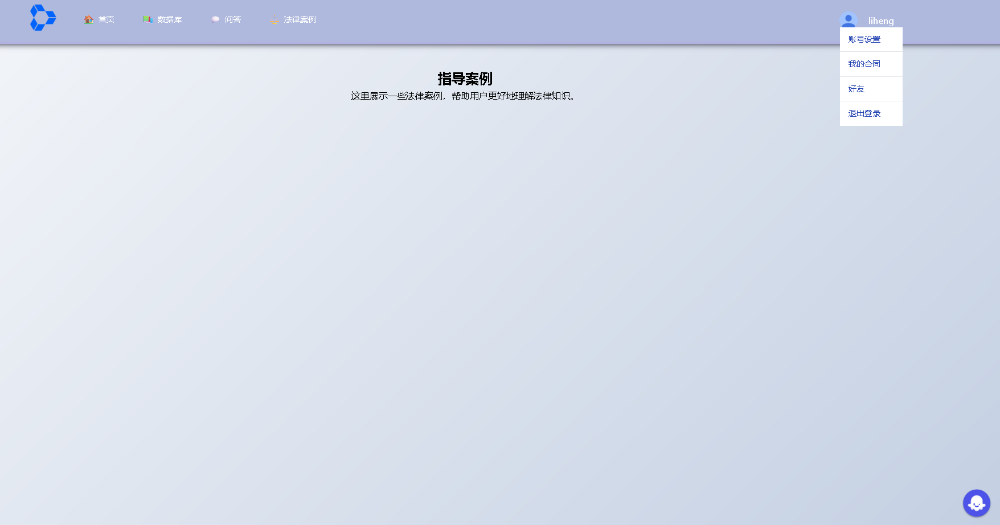
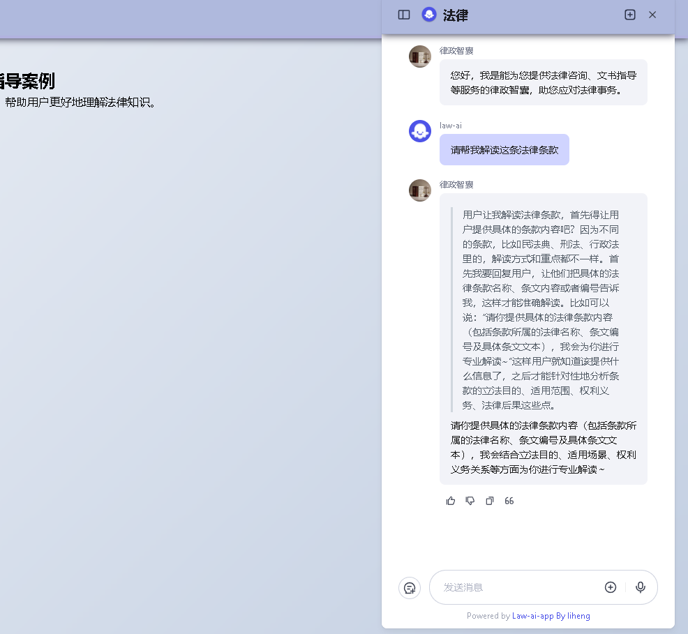
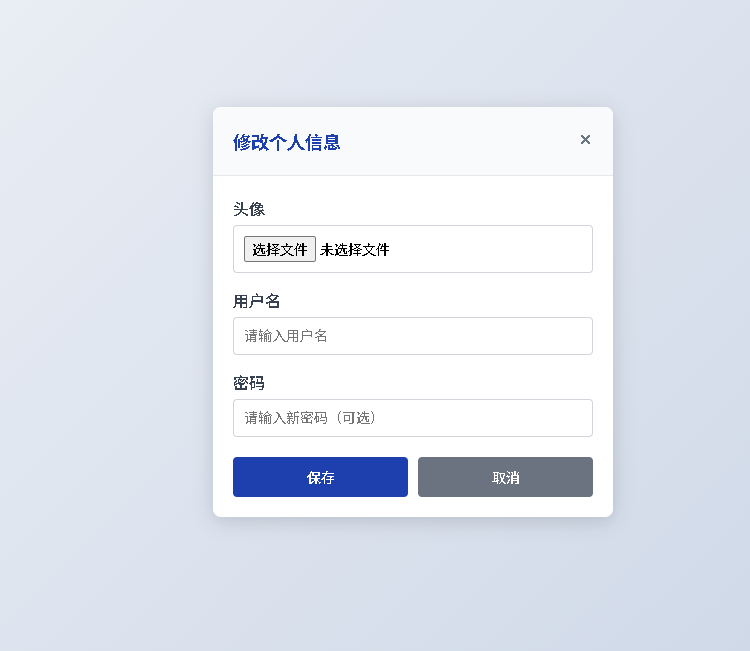

# 法律AI智能应用系统

## 项目简介

本项目是一个面向法律领域的智能化应用系统，旨在通过人工智能技术提升法律工作的效率和质量。系统集成了智能体开发、工具应用和系统解决方案三大核心能力，为法律从业者、企业和个人用户提供全方位的智能化法律服务。

### 同款应用
1. https://law.baidu.com/ 对话工具
2. https://hao.solegal.cn/ 法律导航

### 数据支持
1. https://flk.npc.gov.cn/index 国家法律法规数据库


## 应用功能
### Image





### 1. 智能体开发
- **法律咨询智能体**：基于法律专业知识库，提供7×24小时智能法律咨询服务
- **案件分析智能体**：自动分析案件材料，识别关键法律问题，提供案件预判建议
- **合规审查智能体**：针对企业业务流程进行合规性检查，识别潜在法律风险

### 2. 工具应用开发
- **法律文书自动生成**：根据用户需求自动生成各类法律文书，包括合同、起诉状、答辩状等
- **案例智能检索**：基于语义理解的智能案例检索系统，快速找到相关判例和法条
- **合同条款审查**：自动审查合同条款，识别风险点，提供修改建议
- **证据材料分析**：对证据材料进行智能化整理、分类和分析，提取关键信息

### 3. 系统解决方案
- **智能法律援助平台**：为公众提供便捷的法律援助服务，包括在线咨询、案件受理、进度跟踪等
- **企业合规管理系统**：帮助企业建立完整的合规管理体系，实现合规风险的识别、评估和监控
- **司法辅助决策系统**：为司法工作者提供案件分析、法律条文检索、类案推荐等辅助决策功能

## 实现架构

### 系统架构图

```
┌─────────────────────────────────────────────────────────────┐
│                        用户界面层                              │
│  ┌──────────┐  ┌──────────┐  ┌──────────┐  ┌──────────┐     │
│  │ Web前端  │  │ 移动端   │  │ API接口  │  │ 管理后台  │     │
│  └──────────┘  └──────────┘  └──────────┘  └──────────┘     │
└─────────────────────────────────────────────────────────────┘
                              ↓
┌─────────────────────────────────────────────────────────────┐
│                        应用服务层                              │
│  ┌──────────────┐  ┌──────────────┐  ┌──────────────┐      │
│  │ 智能体服务    │  │ 工具应用服务  │  │ 系统解决方案  │      │
│  │ - 咨询服务    │  │ - 文书生成    │  │ - 法律援助    │      │
│  │ - 案件分析    │  │ - 案例检索    │  │ - 合规管理    │      │
│  │ - 合规审查    │  │ - 条款审查    │  │ - 司法辅助    │      │
│  └──────────────┘  └──────────────┘  └──────────────┘      │
└─────────────────────────────────────────────────────────────┘
                              ↓
┌─────────────────────────────────────────────────────────────┐
│                        AI能力层                                │
│  ┌──────────────┐  ┌──────────────┐  ┌──────────────┐      │
│  │ 自然语言处理  │  │ 知识图谱     │  │ 机器学习     │      │
│  │ - 文本理解    │  │ - 法律知识库  │  │ - 案件预测    │      │
│  │ - 语义分析    │  │ - 法条关联    │  │ - 风险评估    │      │
│  │ - 情感分析    │  │ - 案例关联    │  │ - 模式识别    │      │
│  └──────────────┘  └──────────────┘  └──────────────┘      │
└─────────────────────────────────────────────────────────────┘
                              ↓
┌─────────────────────────────────────────────────────────────┐
│                        数据层                                  │
│  ┌──────────────┐  ┌──────────────┐  ┌──────────────┐      │
│  │ 法律数据库    │  │ 文档存储     │  │ 缓存系统     │      │
│  │ - 法条库      │  │ - 案例文档    │  │ - Redis      │      │
│  │ - 判例库      │  │ - 合同文档    │  │ - Memcached  │      │
│  │ - 文书模板    │  │ - 证据材料    │  │              │      │
│  └──────────────┘  └──────────────┘  └──────────────┘      │
└─────────────────────────────────────────────────────────────┘
```


## 许可证
本项目采用 MIT 许可证。


## bug
1. 智能体怎么嵌入到web应用中1.iframe 2.api/sdk  coze / dify ai - solved

2. 记住密码 - not solved

3. multer 上传文件 nodejs上传文件有1MB限制，暂时搁置头像问题 - not solved

4. UI 参考网站：gitee 